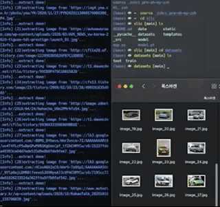

# Slic

## 실행에 필요한 모듈 설치

```bash
pip install -r requirements.txt
```

## 통합 실행

본 패키지는 `Single line image classifier`입니다. **단 한 줄의 명령어로 필요한 이미지 데이터셋을 생성해내고, 자동으로 다중 분류 모델을 학습시키며, 학습이 종료되면 즉시 api를 빌드하여 테스트 환경(localhost)을 구축할 수 있습니다.** 패키지 구성은 아래와 같습니다. *(datasets 폴더와 model.pt의 경우 본 패키지의 사용 방식에 따라 다르게 생성됩니다. 코드 파일이나 아래 "별도 실행"을 참고해주세요.)*

```sh
|--Slic/
|   |--data/
|       |--creater.py
|       |--scraper.py
|   |--model/
|       |--trainer.py
|       |--transformer.py
|       |--predicter.py
|   |--app.py
|   |--staticc/uploads/
|   |--templates/
|       |--index.html
|   |-(datasets/)
|   |-(model.pt)

```

통합 실행하기 위해서는 아래와 같이 `app.py`를 실행하고 -i 옵션을 True로 지정합니다. 만약 데이터셋과 모델이 갖춰져있다면 옵션을 제외할 수 있습니다. -i 옵션을 추가했다면 이어서 -c 옵션으로 클래스 이름들을 지정해줍니다. 데이터셋부터 초기화하는 것이므로 어떤 데이터를 수집할지 사용자가 직접 선택할 수 있습니다.
```python
$python app.py -i True -c "class_A" "class_B" "class_C"
```
만약 -i를 True로 지정했음에도 -c 옵션을 추가하지 않는다면 class name을 지정하라는 메시지를 띄웁니다.
정상적으로 api가 빌드되었다면 localhost 주소를 통해 웹에서 직접 이미지를 업로드하여 모델을 테스트할 수 있습니다.

통합 실행의 경우 각 모듈을 별도로 실행할 때 사용가능한 옵션들을 동일하게 사용할 수 있습니다. 참고할 옵션 파라미터는 아래와 같습니다.
```python
parser.add_argument('-i', '--init', type=bool, default=False)
parser.add_argument('-c', '--class_name', type=str, nargs='+', default=None)
parser.add_argument('-ni', '--num_imgs', type=int, default=50)
parser.add_argument('-sf', '--save_folder', type=str, default="datasets")
parser.add_argument('-l', '--limit_time', type=int, default=10)
parser.add_argument('-f', '--force_replace', type=bool, default=False)
parser.add_argument('-t', '--train', type=bool, default=True)
parser.add_argument('-ts', '--train_size', type=int, default=40)
parser.add_argument('-p', '--pre', type=bool, default=False)
parser.add_argument('-m', '--model_path', type=str, default="./")
parser.add_argument('-df', '--data_folder', type=str, default="datasets")
parser.add_argument('-b', '--batch_size', type=int, default=4)
parser.add_argument('-s', '--shuffle', type=bool, default=True)
parser.add_argument('-ne', '--num_epochs', type=int, default=16)
```

다음은 정상적으로 빌드되었을 때의 최종 결과물입니다.


---
## 별도 실행

본 패키지는 4개의 하위 모듈들을 연결하도록 구성되어 있습니다. 따라서 각 기능별로 모듈을 별도로 실행할 수 있으며 데이터셋만 필요한 경우 `creater.py`를, 데이터셋은 이미 폴더별로 구성되어 있고 모델 학습이 필요한 경우 `trainer.py`을, 모델 학습까지 완료되었다면 `app.py` 모듈을 기본값(-i False)으로 사용하면 local 상에서 rest api 테스트 환경을 빌드할 수 있습니다. 또한 api를 빌드하기 전에 cli 환경에서 가볍게 테스트할 수 있도록 `predicter.py` 모듈을 함께 제공하고 있습니다.

### 1. create datasets (./data/creater.py)

root(./slic) directory에서 아래 명령을 실행하면 각 class 이름('class_A', 'class_B', 'class_C')에 해당하는 이미지를 웹에서 자동으로 다운로드합니다. 각 class별로 수집할 이미지 수는 -n 옵션으로 지정할 수 있으며 default는 50입니다. 또한, 저장되는 폴더명은 -d 옵션으로 지정할 수 있으며 default는 "datasets"입니다. 즉, ./slic/datasets 안에 각 class별 폴더가 생성됩니다.
```sh
$python ./data/creater.py -c "class_A" "class_B" "class_C"
```

만약 모델 학습용 데이터셋을 구축하고자 한다면 아래와 같이 -c 옵션으로 수집을 위해 웹에서 검색할 이미지 이름을 나열합니. 만약, 모델 학습 목적이 아니라면 -t 옵션을 false로 지정할 수 있습니다. train_size는 -ts 옵션으로 지정할 수 있으며 default는 40입니다. 이렇게 train 모드로 creater.py를 실행하면 ./slic/datasets 안에는 바로 하위 폴더로 train, test 폴더가 생성되며 그 하위에 각각 class별 폴더가 생성됩니다.
```sh
$python ./data/creater.py -c "class_A" "class_B" "class_C"
```

참고할 옵션 파라미터는 아래와 같습니다.
```python
parser.add_argument('-c', '--class_name', type=str, nargs='+')
parser.add_argument('-ni', '--num_imgs', type=int, default=50)
parser.add_argument('-sf', '--save_folder', type=str, default="datasets")
parser.add_argument('-l', '--limit_time', type=int, default=10)
parser.add_argument('-f', '--force_replace', type=bool, default=False)
parser.add_argument('-t', '--train', type=bool, default=True)
parser.add_argument('-ts', '--train_size', type=int, default=40)
```

다음은 이미지 데이터 수집기가 정상적으로 실행되는 모습입니다.


### 2. make classification model(./model/py)

root(./slic) directory에서 아래 명령을 실행하면 `datasets` 폴더에서 train, test 데이터를 가져와 모델 학습이 시작됩니다. 데이터셋 폴더가 다른 이름으로 저장되어 있다면 -df 옵션으로 새롭게 지정할 수 있습니다. 학습 과정에서 가중치 파라미터를 포함한 전체 모델은 default로 root(./slic) directory에 `model.pt`로 저장됩니다. 저장될 경로를 변경하려면 -m 옵션으로 경로를 지정해줄 수 있습니다. 이 옵션은 이미 학습한 모델을 재학습시킬때에도 사용되는데, -m 옵션으로 지정한 경로에서 모델 파일을 불러오기 때문입니다. 
```sh
$python ./model/trainer.py 
```

사용자가 별도로 class 명을 지정해줄 필요가 없습니다. 내부적으로 -df 옵션 혹은 default로 지정된 데이터셋 폴더를 탐색해서 모든 class를 리스트로 불러옵니다.

참고할 옵션 파라미터는 아래와 같습니다.
```python
parser.add_argument('-p', '--pre', type=bool, default=False)
parser.add_argument('-m', '--model_path', type=str, default="./")
parser.add_argument('-df', '--data_folder', type=str, default="datasets")
parser.add_argument('-b', '--batch_size', type=int, default=4)
parser.add_argument('-s', '--shuffle', type=bool, default=True)
parser.add_argument('-ne', '--num_epochs', type=int, default=16)
``` 

### 3. test prediction (./model/predicter.py)
학습한 모델을 cli 환경에서 테스트해볼 수 있습니다. 분류할 클래스 중 하나에 해당하는 1장의 이미지를 준비한 다음 아래 명령을 실행하세요. 이 때, -f 옵션으로 이미지 경로를 지정해줍니다. 본 모델을 사용할 경우 반드시 사전에 학습시킨 model.pt파일을 root 경로에 포함시켜야 합니다.
```python
$python ./model/predictor.py -f "./example_image.jpg"
```

참고할 옵션 파라미터는 아래와 같습니다.
```python
parser.add_argument('-f', '--file', nargs=1, type=str)
```

### 4. build test api (./app.py)
`app.py` 모듈은 통합 실행을 위한 모듈이지만 별도로 실행할 수 있도록 개발되었습니다. 따라서 아래와 같이 옵션 없이 기본값으로 실행할 경우 별도 실행 프로세스가 동작하며, 데이터 수집이나 모델 학습 과정은 건너띄고 플라스크 api만 단독으로 빌드됩니다.
이 경우, 데이터셋과 모델이 정상적으로 root 경로에서 탐색할 수 있음을 가정하고 있으며 데이터셋 혹은 모델의 경로가 default로 지정된 경로와 다르다면 해당 값을 옵션으로 별도 지정해줍니다. 옵션은 통합 실행시 안내된 parameter를 참고해주세요.
```
$python app.py
```

---
> reference

1. [(github)gurugaurav/bing_image_downloader](https://github.com/gurugaurav/bing_image_downloader)
2. [(document)Transfer learning for computer vision tutorial](https://pytorch.org/tutorials/beginner/transfer_learning_tutorial.html)
3. [(document)deploying with flask](https://pytorch.org/tutorials/recipes/deployment_with_flask.html)
4. [(document)deploying pytorch in python via a rest api flask](https://pytorch.org/tutorials/intermediate/flask_rest_api_tutorial.html)
3. [(github)avinassh/pytorch-flask-api](https://github.com/avinassh/pytorch-flask-api)

